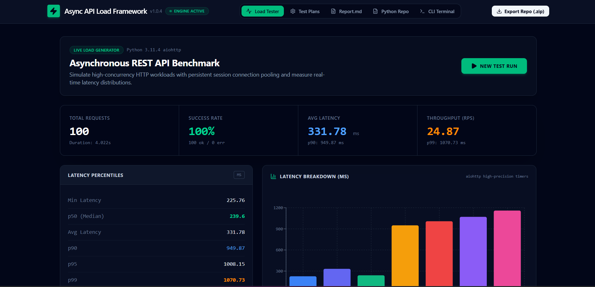
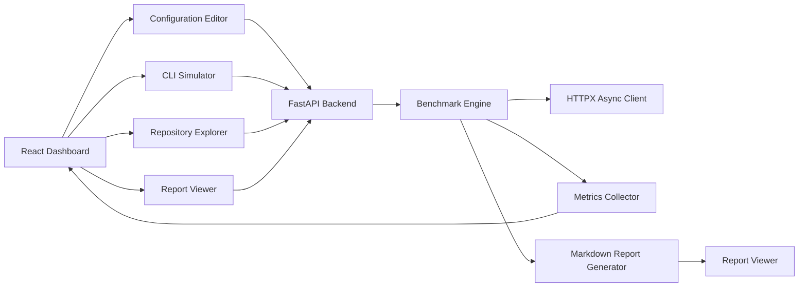
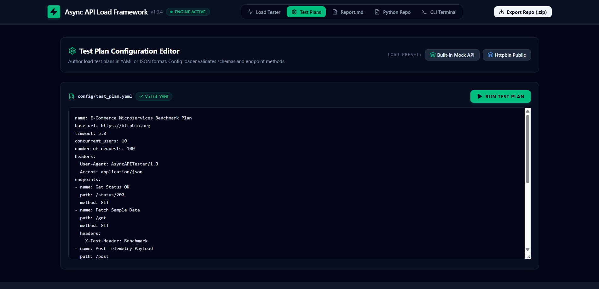
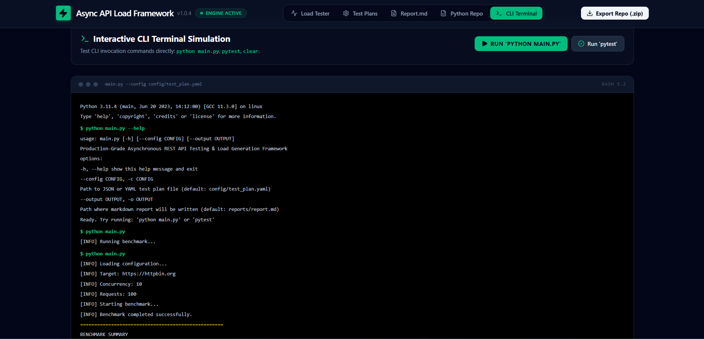
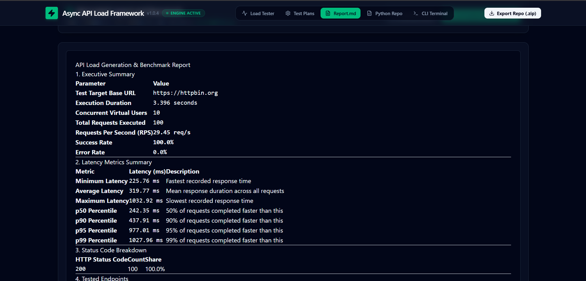
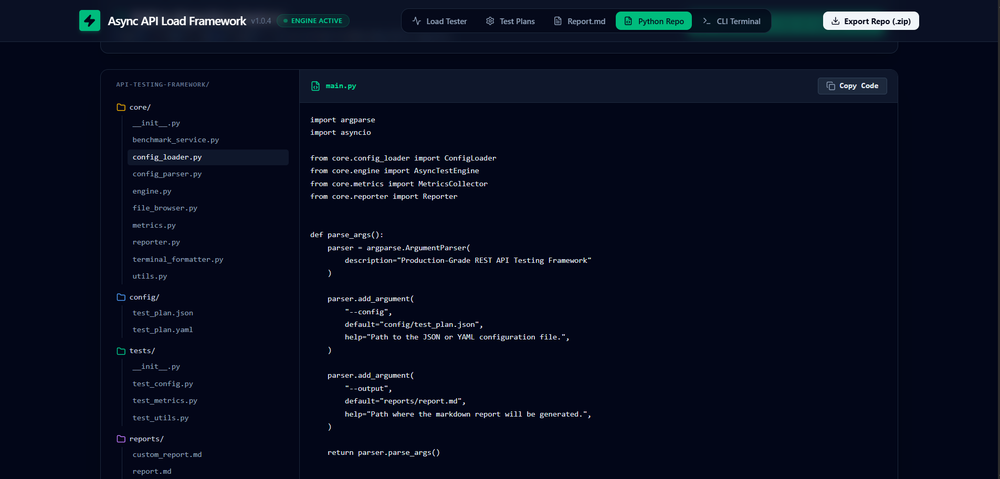
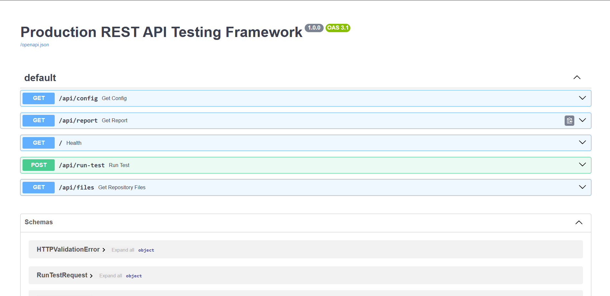

# REST API Testing Framework

<p align="center">


</p>

A REST API testing framework built with **FastAPI**, **React**, **TypeScript**, **HTTPX**, and **Pytest**. The framework provides an interactive web dashboard, asynchronous benchmark execution, YAML-based configuration, Markdown report generation, repository exploration, and a simulated developer CLI for testing and analyzing REST APIs.

---

## Dashboard

<p align="center">

</p>

---

## Overview

Modern backend systems require more than simple API requests—they need reliable performance validation, configurable load generation, structured reporting, and developer-friendly tooling.

This project demonstrates how these capabilities can be combined into a single application that allows developers to:

- Execute asynchronous REST API benchmarks
- Configure tests through editable YAML files
- Visualize benchmark metrics in a modern dashboard
- Browse project files directly from the web interface
- Generate Markdown benchmark reports
- Simulate a command-line testing workflow
- Interact with backend services through a REST API

Rather than acting as a simple API client, this project follows the architecture of an engineering productivity tool, emphasizing modular design, asynchronous execution, clean API boundaries, and an intuitive user experience.

---

## Key Highlights

- Asynchronous HTTP benchmarking using HTTPX
- Interactive React + TypeScript dashboard
- FastAPI backend with REST endpoints
- YAML configuration editor
- Real-time benchmark metrics
- Markdown report generation
- Repository explorer
- Developer CLI simulator
- Swagger/OpenAPI documentation
- Modular, production-inspired architecture

---

## 🚀 Live Deployment

The application is deployed as a full-stack project with independent frontend and backend services.

### Frontend
- **Platform:** Vercel
- **URL:** https://api-testing-framework-wheat.vercel.app

### Backend
- **Platform:** Render
- **API Base URL:** https://api-testing-framework-1.onrender.com
- **Swagger/OpenAPI:** https://api-testing-framework-1.onrender.com/docs

### Deployment Architecture

```text
┌─────────────────────────┐
│      React Frontend     │
│        (Vercel)         │
└────────────┬────────────┘
             │ HTTPS
             ▼
┌─────────────────────────┐
│     FastAPI Backend     │
│        (Render)         │
└────────────┬────────────┘
             │
             ▼
┌─────────────────────────┐
│ Async Benchmark Engine  │
│  HTTPX • AsyncIO • YAML │
└─────────────────────────┘
```

### Production Features

- Fully deployed React + TypeScript frontend
- FastAPI REST API hosted on Render
- Cross-Origin Resource Sharing (CORS) configured for production
- Environment-based API configuration using Vite environment variables
- Interactive Swagger/OpenAPI documentation
- End-to-end benchmark execution from the browser
- Live Markdown report generation
- Repository explorer and CLI simulation

## Table of Contents

- Features
- Architecture
- Technology Stack
- Project Structure
- Installation
- Running the Application
- API Endpoints
- Configuration
- Screenshots
- Benchmark Reports
- Future Enhancements
- License

## Features

### Core Functionality

- **Asynchronous Benchmark Engine**
  - Executes concurrent HTTP requests using HTTPX and AsyncIO.
  - Collects latency, throughput, success rate, and request statistics.

- **Interactive Dashboard**
  - Displays benchmark metrics through a clean React interface.
  - Updates results after each benchmark execution.

- **YAML Configuration Editor**
  - Edit benchmark parameters directly from the browser.
  - Save and reuse configurations without modifying source code.

- **Developer CLI Simulator**
  - Simulates a terminal workflow for running benchmarks.
  - Displays live benchmark summaries returned by the backend.

- **Markdown Report Generator**
  - Automatically generates structured benchmark reports.
  - Suitable for documentation and performance analysis.

- **Repository Explorer**
  - Browse project files directly from the web interface.
  - Provides a lightweight code navigation experience.

- **REST API**
  - FastAPI-powered backend exposing endpoints for benchmark execution, configuration management, reports, and repository browsing.

- **Swagger/OpenAPI Documentation**
  - Interactive API documentation generated automatically by FastAPI.

---

# Architecture



### Architecture Overview

The application follows a client-server architecture.

The **React + TypeScript frontend** provides an interactive interface for configuring benchmarks, executing tests, browsing repository files, and viewing generated reports.

The **FastAPI backend** exposes REST endpoints that orchestrate benchmark execution and file management.

The benchmark engine performs asynchronous HTTP requests using **HTTPX** and **AsyncIO**, collects execution metrics, and generates Markdown reports that can be viewed directly from the dashboard.

This separation of concerns keeps the presentation layer independent from the benchmarking logic and makes the system easier to extend and maintain.

---

# Technology Stack

| Category | Technologies |
|----------|--------------|
| Frontend | React, TypeScript, Vite |
| Backend | FastAPI, Python 3.11 |
| HTTP Client | HTTPX |
| Async Runtime | AsyncIO |
| Configuration | YAML |
| Testing | Pytest |
| API Documentation | Swagger / OpenAPI |
| Styling | CSS |
| Version Control | Git, GitHub |

---

# Design Principles

This project was designed around several engineering principles:

- Modular architecture with clear separation of frontend and backend responsibilities.
- Asynchronous request execution for efficient concurrent benchmarking.
- Configuration-driven workflows using editable YAML files.
- Reusable backend services separated from API routes.
- Developer-focused tooling through REST APIs, CLI simulation, and report generation.
- Clean, maintainable code structure suitable for future feature expansion.

# Project Structure

```text
api-testing-framework/
│
├── api/                    # FastAPI routes
├── core/                   # Benchmark engine and business logic
├── frontend/               # React + TypeScript application
├── reports/                # Generated Markdown benchmark reports
├── config/                 # YAML benchmark configurations
├── screenshots/            # README screenshots
├── tests/                  # Pytest test suite
├── main.py                 # CLI entry point
├── requirements.txt
└── README.md
```

---

# Getting Started

## Prerequisites

Before running the project, ensure the following tools are installed:

- Python 3.11 or later
- Node.js 20+ (or latest LTS)
- npm
- Git

---

## Clone the Repository

```bash
git clone https://github.com/mohit-180/api-testing-framework.git
cd api-testing-framework
```

---

# Backend Setup

### Create a Virtual Environment

```bash
python -m venv .venv
```

### Activate the Virtual Environment

**Windows (PowerShell)**

```powershell
.venv\Scripts\Activate.ps1
```

**Linux / macOS**

```bash
source .venv/bin/activate
```

---

### Install Python Dependencies

```bash
pip install -r requirements.txt
```

---

### Start the FastAPI Server

```bash
uvicorn api.app:app --reload
```

The backend will be available at:

```
http://127.0.0.1:8000
```

Interactive API documentation:

```
http://127.0.0.1:8000/docs
```

---

# Frontend Setup

Open another terminal.

```bash
cd frontend
```

Install dependencies:

```bash
npm install
```

Start the development server:

```bash
npm run dev
```

The frontend will typically be available at:

```
http://localhost:5173
```

---

# Running the Application

1. Start the FastAPI backend.
2. Start the React frontend.
3. Open the frontend in your browser.
4. Configure benchmark parameters.
5. Execute a benchmark.
6. Review metrics and generated reports.

---

# Configuration

Benchmark settings are managed using YAML configuration files.

Typical configuration options include:

- Base URL
- HTTP method
- Request path
- Number of requests
- Concurrent users
- Headers
- Timeout values

Configurations can be edited directly from the web dashboard without modifying application source code.

---

# Running Tests

Execute the test suite with:

```bash
pytest
```

Run the benchmark CLI:

```bash
python main.py
```

---

# Development Workflow

A typical development workflow is:

1. Modify benchmark configuration.
2. Execute benchmark from the dashboard or CLI.
3. Analyze generated metrics.
4. Review the Markdown report.
5. Iterate on configuration or implementation as needed.

# Screenshots

## Dashboard

The main dashboard provides an overview of benchmark execution, performance metrics, and navigation to all framework components.

<p align="center">

</p>

---

## Configuration Editor

Edit benchmark settings directly from the browser using a YAML-based configuration editor.

<p align="center">

</p>

---

## CLI Simulator

A built-in developer terminal that simulates benchmark execution and displays live results returned by the FastAPI backend.

<p align="center">

</p>

---

## Report Viewer

View generated Markdown benchmark reports without leaving the application.

<p align="center">

</p>

---

## Repository Explorer

Browse the project structure directly from the web interface.

<p align="center">

</p>

---

## API Documentation

Interactive Swagger/OpenAPI documentation automatically generated by FastAPI.

<p align="center">

</p>

---

# REST API

| Method | Endpoint | Description |
|---------|----------|-------------|
| GET | `/api/config` | Load the current benchmark configuration |
| POST | `/api/config` | Save benchmark configuration |
| POST | `/api/run-test` | Execute a benchmark |
| GET | `/api/report` | Retrieve the latest benchmark report |
| GET | `/api/files` | Browse repository files |

---

# Example Benchmark Configuration

```yaml
base_url: https://jsonplaceholder.typicode.com

endpoint: /posts

method: GET

headers:
  Accept: application/json

concurrent_users: 25

number_of_requests: 250

timeout: 10

output_path: reports/latest_report.md
```

---

# Sample Benchmark Output

```text
$ python main.py

[INFO] Loading configuration...
[INFO] Target: https://jsonplaceholder.typicode.com
[INFO] Concurrency: 25
[INFO] Requests: 250

[INFO] Starting benchmark...
[INFO] Benchmark completed successfully.

===================================================
                 BENCHMARK SUMMARY
===================================================
Total Requests : 250
Successful     : 250
Failed         : 0
Success Rate   : 100.00%
Average Latency: 118.42 ms
Throughput     : 204.57 req/sec
Duration       : 1.22 sec
===================================================

Markdown report written to:
reports/latest_report.md
```

---

# Example Benchmark Metrics

| Metric | Description |
|---------|-------------|
| Total Requests | Number of HTTP requests executed |
| Successful Requests | Requests completed successfully |
| Failed Requests | Requests that returned an error or failed |
| Success Rate | Percentage of successful requests |
| Average Latency | Average response time across all requests |
| Throughput | Requests processed per second |
| Total Duration | Total benchmark execution time |

---

# Use Cases

This framework can be used to:

- Benchmark REST API performance
- Validate API reliability under concurrent load
- Demonstrate asynchronous programming concepts
- Generate benchmark reports for documentation
- Experiment with API configurations
- Explore FastAPI and React integration
- Learn client-server application architecture

---

# Future Enhancements

The framework is designed with extensibility in mind. Planned improvements include:

- Docker support for one-command deployment
- Authentication support (Bearer Token, API Key, OAuth2)
- WebSocket performance testing
- Scheduled benchmark execution
- Historical benchmark comparison
- CSV and JSON report exports
- Interactive performance charts and trend visualization
- User-defined benchmark profiles
- GitHub Actions CI integration
- Plugin architecture for custom benchmark modules

---

# Contributing

Contributions, feature suggestions, and bug reports are welcome.

If you would like to contribute:

1. Fork the repository.
2. Create a feature branch.
3. Commit your changes.
4. Open a Pull Request describing your changes.

Please ensure that new features include appropriate documentation and tests where applicable.

---

# License

This project is licensed under the **MIT License**.

See the `LICENSE` file for more information.

---

# Acknowledgements

This project was built using several excellent open-source technologies:

- FastAPI
- React
- TypeScript
- HTTPX
- AsyncIO
- Pytest
- Vite
- Swagger / OpenAPI

Special thanks to the maintainers of these projects for providing the tools that make modern Python and web application development more productive.

---

# Author

**Mohit Goswami**

- GitHub: https://github.com/mohit-180
- Repository: https://github.com/mohit-180/api-testing-framework

---

## If you found this project useful

If this project helped you or inspired your own work, consider giving the repository a ⭐.

Feedback, suggestions, and contributions are always appreciated.